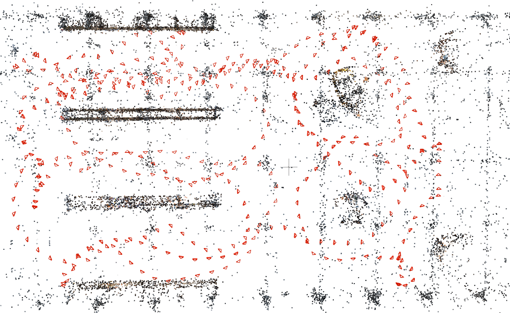

# COLMAP Utility Scripts


* [Install](#install)
* [Overview](#overview)
* [Scripts](#scripts)
  * [Reconstruct SfM models from posed images](#reconstruct-sfm-models-from-posed-images)
  * [Localize new images against SfM models](#localize-new-images-against-sfm-models)
  * [Computing localization errors](#computing-localization-errors)
  * [Visualize matched landmarks](#visualize-matched-landmarks)
  * [Extract information of the 3D points](#extract-information-of-the-3d-points)
* [Using Custom Features](#using-custom-features)
* [Acknowldgement and Related Projects](#acknowldgement-and-related-projects)

This repository provides several python scripts using the [COLMAP command line interface](https://colmap.github.io/cli.html) for 3D vision tasks, primarily:

* reconstruct 3D model from posed images
* register (localize) images with respect to a known 3D SfM model
* evaluating localization error, given reference poses

It is recommended to [get familiar with COLMAP workflows](https://colmap.github.io/tutorial.html) before using the scripts in this repository.
In addition to the SIFT features supported natively by COLMAP, the 3D reconstruction and registration also support custom features (similar to the [visuallocalizationbenchmark](https://github.com/tsattler/visuallocalizationbenchmark)).
See [the description](#using-custom-features) below.


## Install

> The code uses python3 and is tested on Ubuntu 18.04.

First install [COLMAP](https://colmap.github.io/index.html) according to the [instructions](https://colmap.github.io/install.html#linux). `colmap` should be in the system path (executable from the terminal) before you proceed.

Then create a conda environment from the provided `conda_env.txt` file.
```sh
conda env create --name colmap_utils --file conda_env.txt
conda activate colmap_utils
```

## Overview
We use the command-line interface provided by COLMAP. For exchanging information with COLMAP, we read/write [the SQLite database file used by COLMAP](https://colmap.github.io/database.html) or plain text files (e.g., for camera intrinsics and poses as in [COLMAP's output](https://colmap.github.io/format.html#text-format)).

The scripts at the top level of this repository provide different functionalites by making use of the code in `utils` folder, which includes:
* `colmap_read_model.py`: modfied from [the script provided by COLMAP](https://github.com/colmap/colmap/blob/master/scripts/python/read_write_model.py) for reading the SfM models
* `colmap_utils.py`: this scripts implements many common functions using COLMAP
    * wrappers around COLMAP commands for feature extraction/matching, triangulation, etc.
    * common opertaions the COLMAP databases (e.g., add/delete cameras and features).
* `exp_utils.py`: various functions such as reading/writing text files of certain formats, converting different pose conventions, etc.
* `torch_matchers.py`: mutual nearest neighborhood matcher using `pytorch`, used for matching custom features (SIFT features are matched using COLMAP directly instead).

For reconstruction and image registration, we will follow [COLMAP's convention for folder structure](https://colmap.github.io/tutorial.html#quickstart).


## Scripts

**Example Data** Download and extract the test data from [here](https://drive.google.com/drive/folders/1W6cOsAE0Y6r5PuxL77gdsuSPYFtzWwxS), including images in a simulated warehouse environment and corresponding poses and intrinsics. They will be used as working examples for our scripts. You should have a folder containing `warehouse_base` and `warehouse_reg` after extracting the test data. Next we will work through the process of 
* building a SfM model (referred as base model) in `warehouse_base`
  * `reconstruct_from_known_poses.py`
* localizing images from `warehouse_reg` w.r.t. the base model
  * `generate_img_rel_path.py` and `register_images_to_model.py`
* evaluating the localization error of the images in `warehouse_reg`
  * `calculate_pose_errors.py`

### Reconstruct SfM models from posed images

The underlying workflow is described [here](https://colmap.github.io/faq.html#reconstruct-sparse-dense-model-from-known-camera-poses). Using the downloaded test data, the following command 

```sh
# in warehouse_base
python <repo_dir>/reconstruct_from_known_poses.py ./ --img_to_colmap_cam_list ./img_nm_to_colmap_cam.txt --img_to_colmap_pose_list ./img_name_to_colmap_Tcw.txt  --overwrite_db
```
will build a SfM model using the given poses and images:


`img_nm_to_colmap_cam.txt` and `img_name_to_colmap_Tcw.txt` provides the mapping from the names of images (under `images` folder) to the intrinsics and poses respectively, following [the convention of COLMAP output](https://colmap.github.io/format.html#text-format).

**Customization** There are also additional options for finer control of the reconstruction process, for example
* specifying pairs of image to match instead of exhaustive matching
* sequential matching if the images are provided in a temporal order
* allowed reprojection error and view angle difference for the triangulated points

Please see the documentation (use `--help`) for details.

### Localize new images against SfM models
The underlying workflow is described [here](https://colmap.github.io/faq.html#register-localize-new-images-into-an-existing-reconstruction), for which we use the following scripts for convenience.
#### Step 1: generating necessary files
Providing images for COLMAP to localize requires the paths to the images and their intrinsics.
We provide a script to conveniently generate such information.

The following command
```sh
# in warehouse_reg
python <repo_dir>/generate_img_rel_path.py --base_dir ../warehouse_base/images --img_dir ./images --output_dir ./images --img_nm_to_cam_list ./img_nm_to_colmap_cam.txt
```
will generate two files  `rel_img_path.txt` and `rel_img_nm_to_cam_list.txt` under `warehouse_reg/images`, which specify where to find the images to localize and its intrisics respectively.
`--base_dir` points to the image folder of the SfM model that you wish to localize against, and `--img_dir` contains the images to be localized.

#### Step 2: localize images using COLMAP
After generating the necessary files using `generate_img_rel_path.py`, running the following command will register/localize new images with respect to a provided COLMAP SfM model
```sh
# in warehouse_base
python <repo_dir>/register_images_to_model.py ./ --reg_name test --upref_no_time --reg_list_fn ../warehouse_reg/images/rel_img_path.txt --img_nm_to_colmap_cam_list ../warehouse_reg/images/rel_img_nm_to_cam_list.txt
```
The new model (base images + registered images) will be stored in the `warehouse_base` folder in COLMAP format: a database and a folder storing the SfM model. The `warehouse_base` folder will look like something like:

```
├── test_database.db --> new database
├── test_sparse --> new SfM model (base images + registered images)
├── database.db --> base database
├── sparse --> base SfM model
├── images
├── img_name_to_colmap_Tcw.txt
├── img_nm_to_colmap_cam.txt
└── tmp_files
```
and the difference between the new and base model can be visualized in COLMAP (the added cameras stand for localized images)


**Customization** You can also control the following in the script:
* output folder name (e.g., use current time as a unique id)
* minimal number of inliers for considering localizaiton as a success
* specifying positional prior to only match part of the images in the base model

Please see the documentation for details using `--help` with the script.

### Computing localization errors
The following command
```sh
python <repo_dir>/calculate_pose_errors.py --reg_model_dir ./test_sparse  --reg_img_name_to_colmap_Tcw ../warehouse_reg/img_name_to_colmap_Tcw.txt --reg_img_dir ../warehouse_reg/images  --output_path ./
```
will try to find the images from `--reg_img_dir`  in the model stored in `--reg_model_dir` and compare the poses with the reference poses specified by `--reg_img_name_to_colmap_Tcw`.
The result will be written as `pose_errors.txt` under `--output_path` in the format of 

```txt
# image_name trans_e_m rot_e_deg
00000.png 0.03158575534376192 0.04768104699393548
00001.png 0.011878802708131082 0.027693886157393488
00002.png 0.04049015700651593 0.040737153193554886
......
```

### Visualize matched landmarks
If you prefer some visualization of the matched landmarks in the new images, the following command

```sh
# in warehouse_base
mkdir viz
python <repo_dir>/viz_matched_landmarks.py --database ./test_database.db --img_dir ./images --model_dir ./test_sparse --rel_img_list ../warehouse_reg/images/rel_img_path.txt  --outdir ./viz --make_video
```
will try to find the images in `--rel_img_list` in the SfM model specified by `--database` and `--model_dir` and overlay the landmarks on the images.

You can find the overlayed images and a corresponding video under `--outdir`, for example


### Extract information of the 3D points
There are also two scripts that extract certain landmark information from COLMAP models
* `strip_points3d.py`: extract the 3D positions of the landmarks and store them in a text file
* `calculate_point_view_direction.py`: calculate the average view directions of the landmarks and store them in a text file
  * this basically tells us from which direction a landmark can be observed/matched, which is useful for considering the viewpoint change from a novel view

## Using Custom Features
To use custom features, one first needs to extract the features and store them in the same place as the images.
We follow the same convention as the [Visual Localization Benchmark](https://www.visuallocalization.net/). Please read [the instructions](https://github.com/tsattler/visuallocalizationbenchmark/tree/master/local_feature_evaluation#local-features-format).

After the features are extracted, simply adding the argument `--method <ftr_type>` to the reconstruction and registration scripts will make the scripts use the specified feature instead of SIFT.

The allowed custom features are stored in `supported_custom_ftrs` in `utils/colmap_utils.py`, where one should can add desired features.
At this moment, only [D2-Net](https://github.com/mihaidusmanu/d2-net) has been tested (i.e., using `--method d2-net`).
As long as the new features follows the format mentioned above, the reconstruction/registration scripts should still work.

## Acknowldgement and Related Projects

The initial versions of the scripts were developed with much help from [Torsten Sattler](https://github.com/tsattler).

Another project that interfaces COLMAP is [pycolmap](https://github.com/mihaidusmanu/pycolmap), which exposes certain functionalities as python interfaces.
Differently, this repository uses the exiting command line interface, similar to [visuallocalizationbenchmark](https://github.com/tsattler/visuallocalizationbenchmark), which is one main reference for the implementation here.

